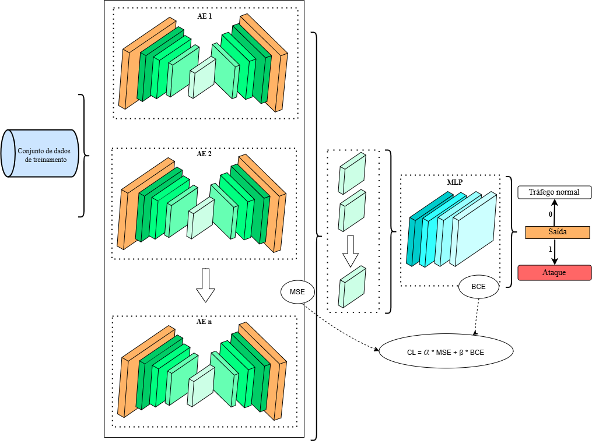

# Network Intrusion Detection Systems With Domain Adaptation

&nbsp;&nbsp;&nbsp;&nbsp;This work advances the traditional model by employing an ensemble of Deep AutoEncoders organized into two stages. In the first stage, each Deep AutoEncoder extracts a distinct set of latent features, with diversity ensured by varying architectural configurations (number of neurons and layers). This structural heterogeneity enables the system to capture multiple perspectives of the data, thereby enhancing its generalization capability. In the second stage, training incorporates both the diversity of the AutoEncoder’s latent spaces and the accuracy of the resulting model. This design allows the model to integrate complementary information learned by each AutoEncoder, thereby optimizing overall performance. Joint training is conducted in a multi-objective setting, where feature extraction and classification are tuned simultaneously. By accounting for latent diversity alongside global accuracy, the model preserves its effectiveness even under varying network conditions.

  

   

# In summary, the main objectives of this work are:

• To evaluate the generalization capability of traditional ML techniques in NIDS, assessing their performance across multiple domains, where experiments demonstrate their limited ability to generalize;

• Develop an ML model based on an ensemble of Deep AutoEncoders, designed to extract diverse features and improve generalization, thereby enabling deployment across heteroge neous network domains for NIDS;

• To compare the results obtained from training with varying architectural configurations of the Deep Autoencoder ensem- ble, using different datasets to pursue DA.

# Project Setup

Start by cloning the project (Install git: https://git-scm.com/download):

Shell: # git clone --depth=1 https://github.com/andreluizsp/NIDS-With-DA.git && cd NIDS-With-DA

This will create a new directory called "NIDS-With-DA" containing the following files:

$ ls

  <b>00_MLP_1_Dataset1.ipynb</b>
    Jupyter Notebook: Este notebook demonstra um modelo tradicional de Machine Learning (usando uma MLP) que aprende no dataset1 e testa no dataset1 
  
  <b>01_MLP_1_Dataset2.ipynb</b>
    Jupyter Notebook: Este notebook demonstra um modelo tradicional de Machine Learning (usando uma MLP) que aprende no dataset1 e testa no dataset1 
  
  <b>02_MLP_1_Dataset3.ipynb</b>
    Jupyter Notebook: Este notebook demonstra um modelo tradicional de Machine Learning (usando uma MLP) que aprende no dataset1 e testa no dataset1  
  
  <b>03_MLP_1_Dataset4.ipynb</b>
    Jupyter Notebook: Este notebook demonstra um modelo tradicional de Machine Learning (usando uma MLP) que aprende no dataset1 e testa no dataset1 

  <b>04_MLP_4_E10-26Features-FineTunning-MultiClass.ipynb</b>
    Jupyter Notebook: Este notebook demonstra um modelo tradicional de Machine Learning (usando uma MLP) que aprende no dataset1 e testa no dataset1 
    
  <b>09_1AE-512_MLP_4_Ambos-E10_26Features-FineTunning-MultiClass.ipynb</b>
    Jupyter Notebook: Este notebook demonstra um modelo tradicional de Machine Learning (usando uma MLP) que aprende no dataset1 e testa no dataset1 
    
  <b>11_2AE_MLP_4_Ambos-512-512-E10-100_26Features-PesoDissimilaridade7-MultiClass.ipynb</b>
    Jupyter Notebook: Este notebook demonstra um modelo tradicional de Machine Learning (usando uma MLP) que aprende no dataset1 e testa no dataset1 
    
  <b>15_3AE_MLP_4_Ambos-512-512-256-E10-100_26Features-Multiclass.ipynb</b>
    Jupyter Notebook: Este notebook demonstra um modelo tradicional de Machine Learning (usando uma MLP) que aprende no dataset1 e testa no dataset1 
